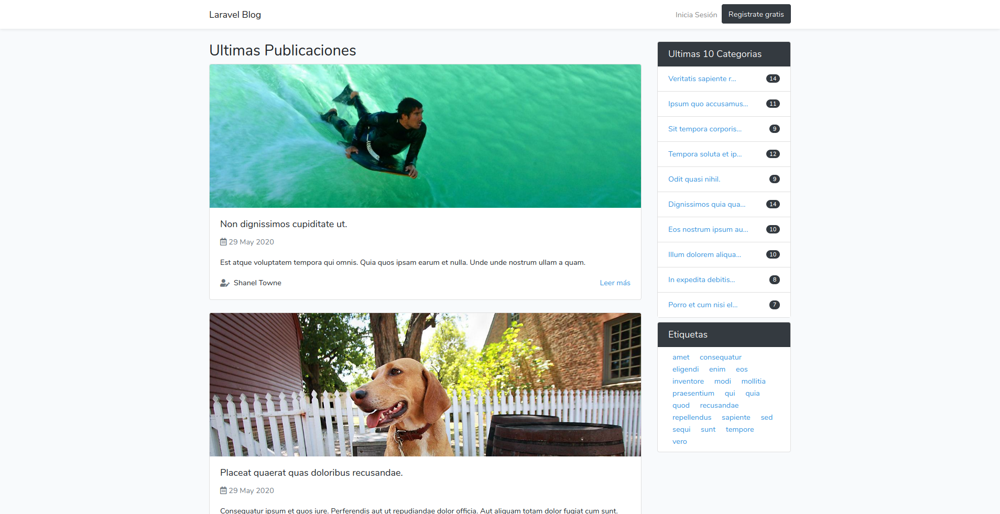

## Blog con Laravel



Aplicación web de un blog desarrollado con laravel 7. con los siguientes modulos:

-   **Etiquetas.-** Gestión de etiquetas (tags) para agregarlos a las entradas
-   **Categorias.-** Gestión de categorias para agregar a las entradas.
-   **Entradas.-** Gestión de entradas donde se visualiza solo las entradas el usuario conectado.
-   **Blog.-** Visualización de las entradas creadas ordenas por fecha de creación, visualizando también la lista de categorias y etiquetas

### Instalación

Realizar los siguientes comandos:

Clona el repositorio

```bash
$ git clone https://github.com/carlossantesp/blog.git
```

Instala los paquetes de composer

```bash
$ composer install
```

Instala los paquetes de npm

```bash
$ npm install
$ npm run dev
```

Copiar el archivo `.env-example` y renombrar por `.env`

```bash
$ cp .env-example .env
```

### Configuración

Para configurar la aplicacion realizar los siguientes pasos:

Generar la key del proyecto

```bash
$ php artisan key:generate
```

Configurar la base de datos en el archivo `.env`

```text
DB_CONNECTION=mysql
DB_HOST=127.0.0.1
DB_PORT=3306
DB_DATABASE=basedatos
DB_USERNAME=root
DB_PASSWORD=
```

> En `DB_DATABASE` debe colocar el nombre de la base de datos y `DB_USERNAME` el usuario para conectarse a la base de datos por defecto es `root` y en `DB_PASSWORD` la contraseña a la base de datos

Crear las migraciones de las tablas de la base de datos

```bash
$ php artisan migrate
```

> Si desea cargar datos de prueba puede ejecutar comando `php artisan db:seed`, este creara varios usuarios de prueba uno de esos es `admin.laravel@example.com` y password `password`

### Iniciar el servidor

Para iniciar el servidor usar el siguiente comando

```bash
$ php artisan serve
```

> La dirección del servidor es [http://127.0.0.1:8000/](http://127.0.0.1:8000/)

#### Aclaración
Las imagenes se guardan el la carpeta `/storage/app/public/posts-images` por antes de subir imagenes para las entradas (posts) ejecute el siguiente comando en la terminal

```bash
$ php artisan storage:link
```

Esto crear un link (enlace simbolico) en la carpeta `/public/storage`

>**Nota** .- La imagen `default.jpg` no viene incluida en el projecto debe crear una y colocarlo en la carpeta `/storage/app/public/posts-images` para que en los datos de prueba pueda visualizar la imagen de prueba.
